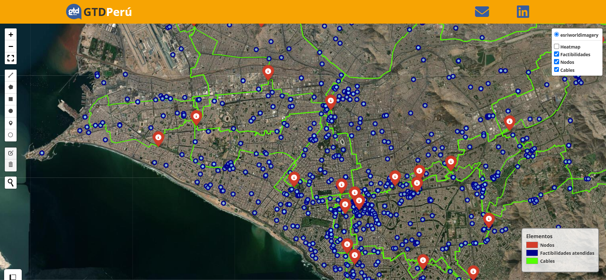
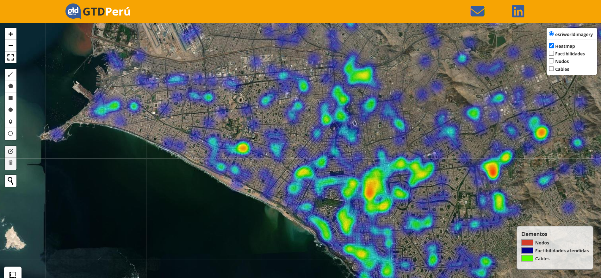
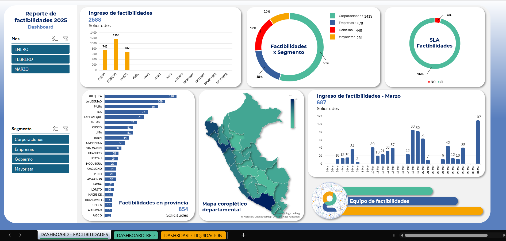
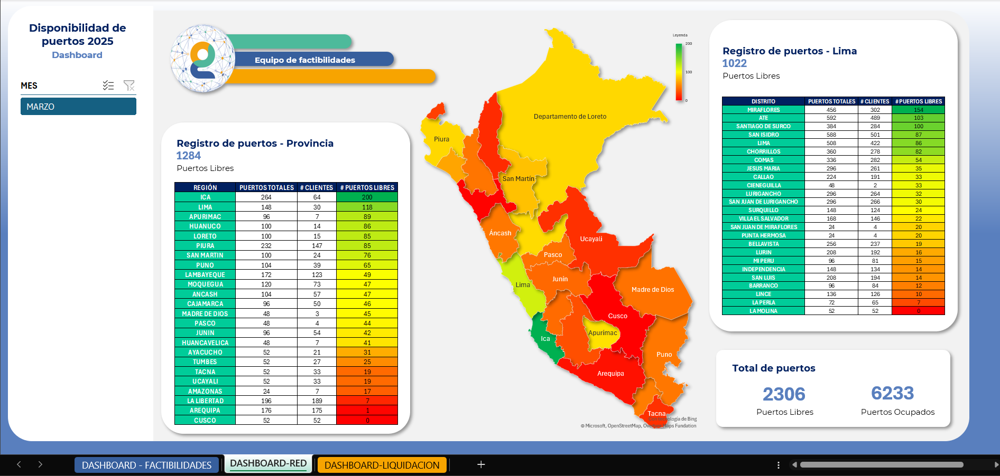
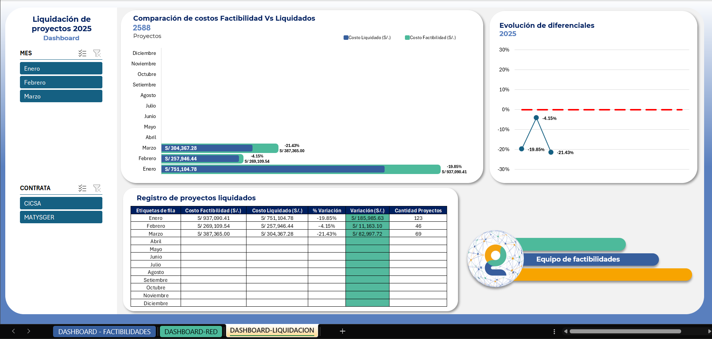

# 📍 Proyecto: DATA CLEANING Y GENERADOR DE UN MAPA DE CALOR

## 🏢 Empresa: GTD Perú  
### Área: Equipo de Factibilidades  
📅 **Objetivo general**: Mejorar la eficiencia en la elaboración de reportes mensuales mediante la corrección de datos geográficos y la creación de herramientas visuales interactivas y automatizadas.

---

## Imágenes de referencia

|  |  |
|--------------------------------------|--------------------------------------|
| **Mapa de factibilidades atendidas**                  | **Mapa de calor de solicitudes**                  |

|  |  | |
|--------------------------------------|--------------------------------------|-----------------------------|
| **Registro de factibilidades atendidas**                  | **Disponibilidad de puertos de red**                  |**Liquidación de proyectos**                 |

## 🎯 Aportes del proyecto

1. **Corregir errores o inexactitudes** en los datos de coordenadas e información de clientes, garantizando la coherencia, precisión y consistencia espacial.
2. **Generar un mapa interactivo** que muestre:
   - Un **mapa de calor** con la distribución de solicitudes procesadas.
   - Elementos relevantes de la **red de telecomunicaciones** (como nodos o troncales).

---

## ⚙️ Librerías Utilizadas

- **Python** como lenguaje principal
- **HTML** para generar salidas web interactivas
- [Folium](https://python-visualization.github.io/folium/) para mapas web
- [Leafmap](https://leafmap.org/) para facilitar mapas avanzados
- [Pandas](https://pandas.pydata.org/) para análisis de datos
- [Geopandas](https://geopandas.org/) y [Shapely](https://shapely.readthedocs.io/) para procesamiento espacial

<em><small>By Jose Luis Perez</small></em>

